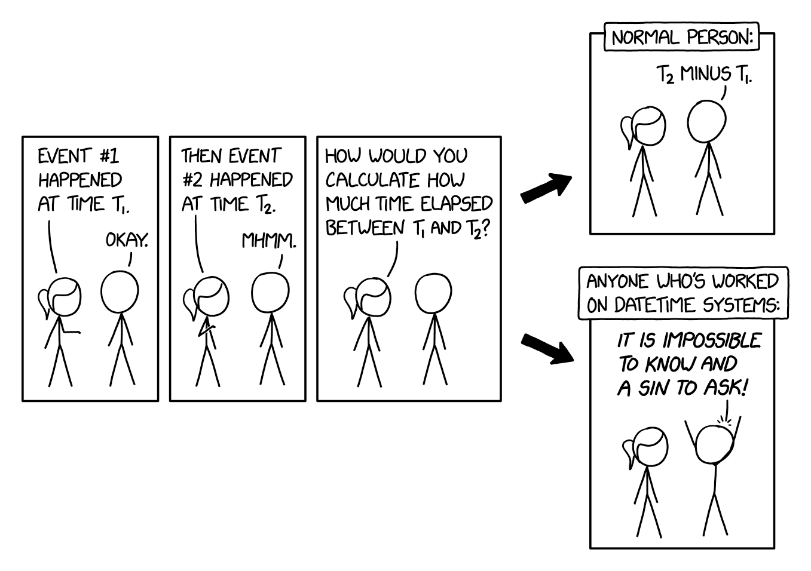

# CODA

Contextual Operations Data Activation

https://coda.fit.nasa.gov/

Consolidating the context of missions, training, and testing into an easy to use platform to relive and revisit each moment. For more info, see https://wiki.jsc.nasa.gov/exploration/index.php/CODA.

Other CODA clock tools

- **The clocksync app**: https://coda.fit.nasa.gov/clocksync/index.html
- **The clockcalc app**: https://coda.fit.nasa.gov/clockcalc/clockcalc.html

## Environments

CODA is deployed using GitLab CI/CD and FIT-provisioned VMs.

| **Branch** | **Environment** | **URL**                         |
| ---------- | --------------- | ------------------------------- |
| `prod`     | production      | https://coda.fit.nasa.gov       |
| `int`      | integration     | https://coda-int.fit.nasa.gov   |
| any        | development     | Any EMSS dev server (see below) |

EMSS dev servers all have element names, and are:

- https://carbon-emss-dev.fit.nasa.gov
- https://gold-emss-dev.fit.nasa.gov
- https://iron-emss-dev.fit.nasa.gov
- https://neon-emss-dev.fit.nasa.gov
- https://oxygen-emss-dev.fit.nasa.gov

## Development

### Software Dependencies

- [NodeJS](https://nodejs.dev/) (see the [Dockerfile](./docker/apiv1/Dockerfile) for the version we're using).
- [Docker Desktop](https://www.docker.com/products/docker-desktop/) (optional)

### First Time Setup

1. Install JavaScript dependencies: `npm i`
2. Get the secret values from another CODA developer and paste them into a new file called `env.secret.ts`.
3. Create a `./.env` file by running `npm run make-dotenv` in the terminal.
4. Get the required NOCA (NASA Operational Certification Authority) Cert. This is required so CODA will authenticate other NASA website's certs.
   1. Go to https://cset.nasa.gov/ascs/application/trust-anchor-management-ntam-for-linux/
   2. In section "Installation for Linux Desktop Use Cases (RHEL only)" (Linux variety is fine for all OSes) go to the "Manual Installation" section
   3. Download zip file
   4. Extract zip and put the `.pem` file into the CODA root directory named `.env.local.cert.pem`

5. **Elevated privileges required:** Change the hosts file to map `coda-local.fit.nasa.gov` to `127.0.0.1`. This is necessary for the direct IO API calls to work, and may be required in the future for LaunchPad authentication.
6. (Required for Docker) Create a self-signed SSL certificate by doing `bash ./scripts/make-dev-ssl-cert.sh`
7. (Optional unless you're making a lot of map requests) Get a Mapbox API key https://account.mapbox.com/. Set it to the `VITE_PUBLIC_MAPBOX_KEY` value in the `.env` file.

### Option 1: Local Dev (non-Docker)

To start CODA locally for development, run the following

```sh
npm run docker:services
npm run dev
```

Then go to (http://coda-local.fit.nasa.gov:3000)

This command sets up a hot-reloading fullstack node server. If any changes are made to the client, they should appear automatically in the browser. If any changes are made to the server, the server should automatically restart.

Bonus: When run locally, the application is already setup to work with [VS Code's debugger](https://code.visualstudio.com/docs/editor/debugging). Once the dev server is up and running, press F5 to attach to it (assuming the default keybindings haven't been changed in VS Code). Now breakpoints can be set and code execution can be inspected. The `.vscode/launch.json` file in this repo includes the debugger configuration.

### Option 2: Fully docker-compose (not recommended for dev)

To preview a production-like setup with a full docker environment, essentially identical to what would be deployed to one of our servers, run the following

```sh
npm run docker:preview
```

Then go to https://coda-local.fit.nasa.gov. Note the HTTPS not HTTP, since the Docker setup is behind an nginx proxy with a self-signed certificate. Also there is no port number specified, since this is over port 443.

You will likely need to accept the self-signed certificate warning.

To be sure that the Docker images are fully rebuilt after making changes to CODA, run `npm run docker:preview:rebuild`. This is generally not required, however, and simply running `npm run docker:preview` again will be sufficient to rebuild just what is necessary (not rebuild everything). To completely rebuild without using the cache, run `npm run docker:preview:rebuild:nocache`

## Other Stuff

### How to Work with this Repo

CODA is written in JavaScript and [TypeScript](https://www.typescriptlang.org/) for the benefit of strong types and uses the following:

1. [React](https://reactjs.org/) - for structuring the front-end components
2. [Vite](https://vitejs.dev/) - for serving the front-end
3. [Express](https://expressjs.com/) - for serving the back end
4. [Redux](https://redux.js.org/) and [Redux toolkit](https://redux-toolkit.js.org/) - for managing global state

### Postgres Version Upgrades

When the Postgres version is updated in `docker-compose.yml`, the database must be migrated:

**For Dev Environments (e.g., gold, iron, etc.):**
For dev environments, when the database version is updated, the database has to be manually migrated by exporting the production database and importing it into the dev environment. This is because we don't know if CODA is already deployed on each dev server so an in-place upgrade might not work--so we don't try.

1. Deploy to the dev environment (e.g., gold)
2. Run the manual CI job `z:db-export:prod` to export the production database
3. Run the manual CI job `z:db-import:<env>` to import the database to the dev environment

**For Integration and Production:**
This does in-place upgrades automatically on every deployment because CODA is always deployed to these environments.

The [`scripts/upgrade-db.sh`](./scripts/upgrade-db.sh) script automatically handles version upgrades on every deployment. It compares the running Postgres version against the target version in `docker-compose.yml` and performs an in-place upgrade if needed (dump → remove old data → reimport on new version).

### A note about Time

- All times are stored internally in UTC
- All durations are stored internally in seconds

{width=480px}

_[XKCD](https://xkcd.com/2867/) understands our pain..._

## APIs

On the server, CODA interacts with external APIs, cleans data, caches responses, provides its data to the client-side via sockets, and exposes its own APIs to provide nicely formatted data to other clients. CODA interacts with external APIs with the code in `src/server/services`.

For more information about the APIs CODA interfaces with: https://eegitlab.fit.nasa.gov/emss/coda/-/wikis/APIs
