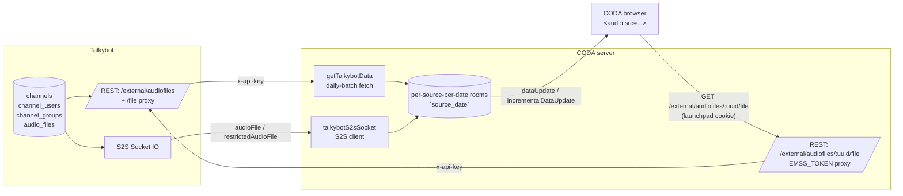
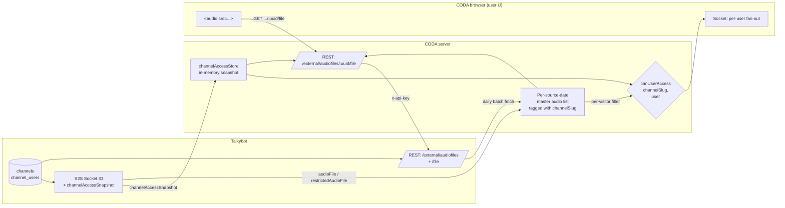

# Per-User Talkybot Audio Access Control in CODA

> **Status:** Design — not yet implemented. v1 of the audio-proxy fix
> (`src/server/express/routes/external/audiofiles.ts`) intentionally treats
> every channel as public; this document is the plan for replacing that
> with real per-user channel-access enforcement.

## TL;DR

Talkybot already owns the authoritative model of "which AUIDs are allowed
on which channels" and already emits a complete `channelAccessSnapshot`
over the existing S2S socket. **No new Talkybot work is required to ship
v2 of this design.** Everything below happens on the CODA side: we consume
the snapshot, label every audio file with its channel slug, and split the
fan-out so each browser only receives the audio files (and transcript
text) it's allowed to see.

The conceptual shift on the CODA side is that **`talkybot` data is no
longer a single "source-wide" payload that every client gets identically.**
It becomes a per-user view computed from a server-side master list plus
the user's effective channel-access set.

## Current architecture (today, post v1 proxy fix)



**Key properties of the current pipeline:**

- Each visitor `socket.join("<source>_<date>")` on `visitorJoin`
  (`src/server/express/sockets.ts:133`).
- `emitIncrementalDataUpdate` and `emitDataUpdate` both call
  `io.to("<source>_<date>").emit(...)` — **all clients in a room get the
  same payload.**
- `getTalkybotData` calls Talkybot's `/audiofiles/all?date=...` endpoint,
  which returns both public and restricted files (gated only by
  `x-api-key === EMSS_TOKEN`). The result is broadcast wholesale to the
  room (`src/server/processing/talkybot.ts`).
- The `dataRetrievalScheduler` entry for `talkybot` has
  `enableCacheUse: false` and `refreshInterval*: null`, so the fetch
  function is called fresh on every `visitorJoin` (per source+date).
  There is no shared in-memory or DB cache to worry about.
- The S2S socket pushes new files via two events:
  - `audioFile` — public channels
  - `restrictedAudioFile` — non-public channels
    CODA currently handles both identically and routes them to all CODA
    sources mapped from the file's `groups[]` via
    `getSourcesForTalkybotGroup`. **Restricted files get fanned out to
    every browser in the relevant `source_date` room.** That is the
    privacy gap this document closes.
- The browser then `<audio src="/api/v1/external/audiofiles/:uuid/file">`
  hits the CODA proxy added in v1, which forwards to Talkybot using
  `EMSS_TOKEN`. The proxy currently authorizes only "is the caller a
  CODA-authenticated user" — it does not check whether the user is
  entitled to the _specific_ file's channel.

## What Talkybot already gives us

Source of truth, no Talkybot changes required:

```ts
// talkybot/types/socketio.d.ts (already exists, already emitted)
interface ChannelAccessSnapshotChannel {
  slug: string;
  name: string;
  enabled: boolean;
  public: boolean;
  groups: string[];
  auids: string[];
}
interface ChannelAccessSnapshot {
  version: number;
  generatedAt: string;
  channels: ChannelAccessSnapshotChannel[];
  superuserRoles: string[]; // e.g. ["EMSS-Superuser"]
}
```

Emission semantics (verified in
`talkybot/apps/server/services/channel-access-snapshot.ts` and
`talkybot/apps/server/sockets.ts`):

- **On S2S client connect:** Talkybot calls `sendSnapshotTo(s2sSocket)`
  and emits a `channelAccessSnapshot` event with the current full state.
- **On any channel-access mutation** (channel CRUD, public/enabled flip,
  ChannelUser add/remove): Talkybot bumps `version` and broadcasts a
  fresh full snapshot as `channelAccessUpdate` to **all** S2S peers.
- Both events deliver the **complete** snapshot (not a diff). This means
  CODA's consumer is trivially correct: "replace the in-memory snapshot
  on every event."

Each audio file already carries `channel.slug` in `TbAudioFileNative`
(see `src/typings/processing/talkybot.d.ts`), so the join from "file" to
"is this user allowed" is just a slug lookup.

## Design goals

1. **No new Talkybot work** beyond what already exists. Reuse the existing
   snapshot and existing `x-api-key` REST surface.
2. **Authoritative gate on the CODA server.** The browser is never a
   trust boundary. A user who is not entitled to a file:
   - never receives the file's metadata over the socket,
   - never sees the file's transcript text in the transcript pane,
   - cannot fetch the file's bytes via the proxy even if they guess the
     UUID.
3. **No regressions for the common case.** Public-channel audio behaves
   exactly as it does today.
4. **Bounded blast radius from a stale snapshot.** A stale snapshot
   should fail closed (deny) for any newly-added user/channel pair, not
   open. Snapshot freshness is observable on the admin inspector.
5. **No new shared secrets.** `EMSS_TOKEN` remains the only S2S secret.
6. **Backward-compatible client.** No new client-side data model; the
   server just emits a filtered subset of the same `talkybot` payload.

## Proposed architecture (v2)



### CODA components, in dependency order

#### 1. `channelAccessStore` (new)

A small in-process module that owns the latest snapshot.

```ts
// src/server/express/channelAccessStore.ts
let snapshot: ChannelAccessSnapshot | null = null;
let receivedAt: string | null = null;

export const setChannelAccessSnapshot = (s: ChannelAccessSnapshot) => { ... };
export const getChannelAccessSnapshot = () => snapshot;
export const getChannelAccessStatus = () => ({
  snapshotVersion: snapshot?.version ?? null,
  snapshotGeneratedAt: snapshot?.generatedAt ?? null,
  receivedAt,
  channelCount: snapshot?.channels.length ?? 0,
});

/**
 * Authoritative access decision.
 * @returns true if the user may receive/play audio on this channel.
 */
export const canUserAccessChannel = (
  user: EmssUser | null,
  channelSlug: string,
): boolean => {
  if (!snapshot) return false;          // fail closed when snapshot is missing
  const ch = snapshot.channels.find(c => c.slug === channelSlug);
  if (!ch || !ch.enabled) return false; // unknown / disabled = deny
  if (ch.public) return true;
  if (!user) return false;
  if (user.roles?.some(r => snapshot!.superuserRoles.includes(r))) return true;
  const auid = user.auid?.toLowerCase();
  if (!auid) return false;
  return ch.auids.some(a => a.toLowerCase() === auid);
};
```

Failure modes:

- **Snapshot missing** (we connected to Talkybot but haven't received a
  snapshot yet, or we're disconnected): deny all non-public access.
  Public-channel files still flow because the master list will be empty
  for restricted ones anyway (see §3).
- **User missing AUID**: deny restricted (matches existing
  `RESTRICTED_OVERRIDES.md` behavior).
- **Snapshot version is N, but a brand-new restricted file arrives whose
  channel was added in N+1**: deny until the next snapshot arrives.
  Talkybot broadcasts on every mutation, so this window is short
  (sub-second on a healthy S2S link). The admin inspector exposes
  `snapshotVersion` and `receivedAt` so operators can spot a stuck
  consumer.

#### 2. S2S consumer wiring (new handlers in `talkybotS2sSocket.ts`)

Add the two events to the `TalkybotS2sServerToClientEvents` interface:

```ts
channelAccessSnapshot: (payload: ChannelAccessSnapshot) => void;
channelAccessUpdate:   (payload: ChannelAccessSnapshot) => void;
```

Register a single handler for both that calls
`setChannelAccessSnapshot(payload)` and pushes status into the existing
`talkybotS2sSocketTrackerData` (new fields `snapshotVersion`,
`snapshotGeneratedAt`, `snapshotReceivedAt`, `channelCount`). The
existing `talkybotS2sSocketInspectorUpdate` admin page surfaces this for
free once the fields are in the type.

#### 3. Master audio list & per-visitor filtering

This is the structural change. Today `getTalkybotData(source, date)` is
called once per `visitorJoin` and the result is socketed to the joining
browser. Two things have to change:

a. **Tag every record with its channel slug at retrieval time.**
`TbAudioFileConverted` already has `channel: string` (the slug) —
already done.

b. **Filter before emit, per visitor.** Replace the unconditional
`socket.emit("dataUpdate", { type: "talkybot", response })` in
`fetchAndEmitAllData` with a `filterTalkybotPayloadForUser(response,
   user)` step. Same idea for the incremental path: instead of
`io.to(room).emit(...)`, walk every socket in the room and emit
individually if `canUserAccessChannel(user, file.channel)`.

The required Socket.IO primitives are already in use:

- `getSocketIO().to(room).fetchSockets()` returns the connected sockets,
  each of which carries the visitor record (we already maintain that in
  `globalValues.serverSocketStatus.visitorsData`).
- We can also just iterate `visitorsData.filter(v => v.source === src
&& v.dateViewing === date)` and `io.to(v.socketId).emit(...)`, which
  is simpler and matches the pattern used for `liveVideoRestrictionUpdate`.

**Performance:** restricted channels are rare and audio updates are
already at human-speech cadence (a handful per minute per channel). The
extra per-socket filter is O(visitors × channels-in-payload) with both
factors small. No new data structures or polling is required.

#### 4. Transcript text

Transcripts ship inline on each `TbAudioFileConverted` (`text` and
`textOriginalLanguage`). Filtering happens at the file level, so a
denied file's text never reaches the client and there is no separate
transcript pipeline to gate.

#### 5. Proxy route gating

The existing v1 proxy in
`src/server/express/routes/external/audiofiles.ts` adds the access check
described in its own docstring:

```ts
const channelSlug = lookupChannelSlugForUuid(uuid);   // see below
if (!channelSlug) { res.status(404)...; return; }
if (!canUserAccessChannel(user, channelSlug)) {
  serverLogger.warn({ logId: "talkybotAudioProxyDenied", uuid, user });
  res.status(403)...; return;
}
// ... existing forward-to-Talkybot logic ...
```

**Where does `lookupChannelSlugForUuid` come from?** We already have
every file's `{uuid → channelSlug}` mapping in the master list (§3a).
Build a `Map<uuid, channelSlug>` keyed by uuid as files arrive (both
daily batch and S2S push). LRU-bound it (e.g. 50k entries, which at
~one-utterance-per-3-seconds is well over a week of all channels). On
proxy lookup miss, do a synchronous fallback: call Talkybot's
`/audiofiles/all?date=YYYY-MM-DD` for the date inferred from the
request? — no, simpler: **just deny on miss with a 404.** The map will
have been populated when the file was originally socketed to the user
(that's a prerequisite for the user to know the uuid to request).

> The only legitimate way for a uuid-miss to happen is a CODA server
> restart between when the browser learned the uuid and when it tried to
> play. That's the same fragility we already have with other ephemeral
> in-memory state (e.g. fetch trackers). The admin inspector should
> surface `lookupMisses` as a counter, and on miss the client gets a
> 404 and silently moves on to the next utterance.

#### 6. Cache invalidation on snapshot changes

When a `channelAccessUpdate` arrives, channel `users[]` or `public` may
have changed. Two paths are affected:

- **Already-connected browsers** that just lost access to a channel
  shouldn't be allowed to keep playing in-flight audio. The simplest
  mitigation: re-fan-out the current talkybot master list to every
  affected visitor, replacing their store contents. The Redux slice
  already supports `setTalkybotAudioFiles` (see
  `src/store/talkybot.ts:31`), so emitting a fresh full `dataUpdate` of
  type `talkybot` is enough — the client replaces its slice and any
  utterance no longer in the list disappears from the transcript pane
  and won't be picked as the next `<audio>` source.
- **In-flight `<audio>` playback** is harder to interrupt mid-stream.
  V2 will not actively kill an in-progress GET; the next-utterance loop
  will just stop selecting newly-denied files. If that proves
  insufficient, a v3 option is to expose a "denied" event on the socket
  that tells the client to pause and reset `srcUrl`.

#### 7. Admin observability

Extend `talkybotS2sSocketInspectorUpdate` (already wired in the admin
socketStatus page) with:

- `snapshotVersion`, `snapshotGeneratedAt`, `snapshotReceivedAt`
- `channelCount`
- `proxyAccessDenied` counter
- `proxyLookupMisses` counter

Extend `visitorInspectorUpdate` with each visitor's
`accessibleChannelCount` (number of channels for which
`canUserAccessChannel(user, slug)` is true) so on-call can answer
"why isn't user X hearing audio for channel Y" by glancing at the
admin page.

## Alternatives considered (and rejected)

### A. Push the gate down to Talkybot per-user

> _"Have Talkybot do the filtering and stream a per-user audio feed to
> CODA."_

This is the model that requires "massive changes to Talkybot" the user
explicitly wants to avoid. It would mean Talkybot's S2S socket
multiplexes per-CODA-user identity, Talkybot accepts CODA's user
identity over an authenticated channel, Talkybot's REST `/audiofiles`
endpoint grows a per-user filter, etc. Talkybot today knows about CODA
as a single S2S peer with one shared secret. Inverting that to "Talkybot
maintains a session per CODA user" is architecturally large and gives
us nothing the snapshot approach doesn't.

### B. Cache audio file bytes in CODA and self-host

> _"Stop hitting Talkybot for audio at playback time. Mirror the files
> into CODA and serve from local disk after gating."_

Tempting (eliminates the cross-origin question entirely), but:

- Storage explosion: ISS keeps a half-dozen channels recording 24/7;
  retention pressure shifts from Talkybot to CODA.
- Cache eviction and "what date am I authoritative for" become real
  questions that Talkybot already answers.
- No actual security gain over §5 — the bytes have to be sent over the
  wire either way, and the gate at the CODA proxy already runs before
  any bytes leave Talkybot.

Worth revisiting only if Talkybot's `/audiofiles/:uuid/file` throughput
becomes a bottleneck.

### C. Per-channel Socket.IO rooms

> _"Make a room per (source, date, channelSlug) and have each browser
> join only the rooms it's allowed in."_

This is the elegant version of §3 — let Socket.IO's room machinery do
the per-user filtering instead of iterating visitors. Two reasons not to
do it in v2:

- Room membership has to change whenever the user's effective access
  changes (channel CRUD, AUID grant/revoke). Doing that correctly means
  re-joining/leaving rooms on every `channelAccessUpdate`, which adds
  state machinery on the server for no measurable benefit over the
  per-emit filter.
- The current room scheme is `<source>_<date>` for **all** data types
  (`gps`, `videos`, `ephemeris`, …). Splitting talkybot off into its
  own room dimension forks the model. The per-emit filter is local to
  the talkybot pipeline.

If we ever generalize per-user filtering to other data types (e.g.
restricted video timelines), this is the right time to reconsider.

### D. Bake AUID-grant into CODA's existing `AccessGrant_db`

> _"Use the same `AccessGrant_db` table that gates restricted media
> overrides. Admins manage Talkybot channel access from the CODA admin
> page."_

This is wrong because Talkybot is the source of truth for channel
access (its `ChannelUser` table is mutated by the Talkybot admin UI
when a new operator is added to a channel). Maintaining a parallel
list in CODA guarantees they diverge. The snapshot is precisely the
mechanism that keeps the two systems aligned without duplication.

## Implementation plan

Each milestone is independently mergeable and reversible.

**M1 — Snapshot consumer, no enforcement.**
Wire `channelAccessSnapshot` / `channelAccessUpdate` handlers, store the
snapshot, expose it on the admin inspector. No behavior change for
users. Validates the S2S contract and gives us operator visibility.

**M2 — Proxy enforcement only.**
Add `canUserAccessChannel` and the uuid→slug map. Plug the access check
into `routes/external/audiofiles.ts`. At this milestone, browsers still
_receive_ metadata for files they can't play, but `<audio>` GETs for
those files return 403. The transcript pane still shows the text. This
is a small, observable, easy-to-revert change that exercises the
snapshot in production.

**M3 — Server-side fan-out filter.**
Filter `dataUpdate` (initial) and `incrementalDataUpdate`
(real-time) emissions for `talkybot` payloads through
`canUserAccessChannel`. After M3, denied files never appear in the
client store, so the transcript pane and the proxy-403 path both stop
having anything to gate.

**M4 — Snapshot-change re-emit.**
On `channelAccessUpdate`, re-emit each affected visitor's full
talkybot payload so newly-revoked channels disappear from already-open
sessions without a reload.

**M5 — Optional: audio-stop signal.**
If operators want it, add a `denyAudio` socket event that clients use
to abort an in-flight `<audio>` element when access is revoked
mid-playback.

## Testing

- **Unit (CODA):** `canUserAccessChannel` truth table — public allow,
  superuser allow via role intersection, auid-in-list allow (case
  insensitive), auid-not-in-list deny, unknown channel deny, disabled
  channel deny, missing snapshot deny, missing user deny.
- **Unit (CODA):** uuid→slug map LRU behavior, eviction, lookup-miss
  returns null.
- **Integration (CODA):** mock S2S socket emits a snapshot, a public
  `audioFile`, and a `restrictedAudioFile`; assert two test visitors
  (one in the channel's auids list, one not) receive the correct
  filtered `dataUpdate`s.
- **Manual (talkybot side):** add a test user to a restricted channel
  via the Talkybot admin UI, confirm the new visitor sees the
  channel's audio within one S2S round-trip and the other does not.
- **No Talkybot test changes needed.**

## Operational notes

- **Snapshot loss = deny by default.** If CODA disconnects from
  Talkybot, the snapshot becomes stale. After a configurable TTL
  (suggest 5 minutes), `canUserAccessChannel` should reject restricted
  access even for previously-allowed users to avoid serving stale
  permissions. Public access continues unaffected because the
  `public` flag is intrinsic to the snapshot itself — there is no
  "fail-open public" mode.
- **First-connect race.** On CODA startup, until the first snapshot
  arrives, all restricted access is denied. The S2S client sends the
  snapshot immediately on connect, so this window is sub-second.
- **AUID casing.** Snapshot AUIDs and JWT AUIDs both need lowercase
  comparison; the existing restricted-videos code does the same.
- **`MOCK_USER=true` dev mode.** Mock users default to
  `EMSS-Superuser`, which the snapshot's `superuserRoles` covers, so
  the developer experience is unchanged. To test the denied path
  locally, set `MOCK_USER_ROLES=` (empty) and pick an `MOCK_USER_AUID`
  not in the seeded channels.

## Out of scope

- Per-AUID gating of other data types (video timelines, photos, GPS).
  This document is talkybot-audio-only; see `RESTRICTED_OVERRIDES.md`
  for the existing video pattern.
- Caching audio bytes in CODA (see Alternative B).
- Talkybot REST changes (see Alternative A).
- A UI in CODA for managing Talkybot channel access (Alternative D).

## Open questions for review

1. **Snapshot TTL on disconnect** — is 5 minutes the right deny-after
   window, or should we fail closed immediately on disconnect?
2. **M5 audio-stop** — desired in v2, or acceptable to land later?
3. **Logging volume** — `serverLogger.info` on every successful proxy
   playback could be noisy. Move to `debug` once the feature is stable?
