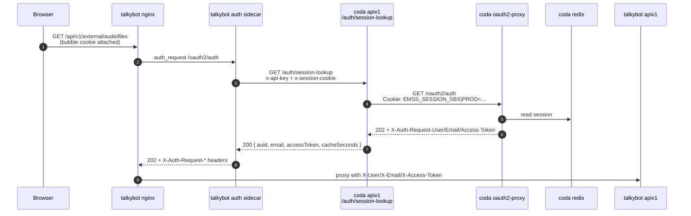
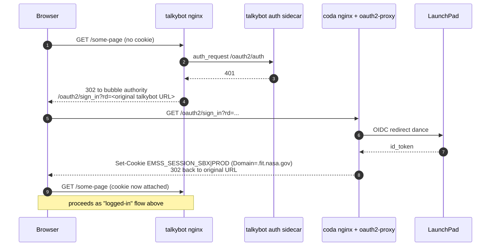

# Shared Session Auth Between CODA and Talkybot via CODA HTTPS Session-Lookup Endpoint

> **Status:** Implementation guide.
> **Companion:** [`UNIFIED_AUTH_TALKYBOT.md`](./UNIFIED_AUTH_TALKYBOT.md)
> (design space). This doc is the committed implementation.

## TL;DR

- CODA exposes one new S2S endpoint, `GET /api/v1/auth/session-lookup`,
  gated by `EMSS_TOKEN` (`x-api-key` header). It takes a bubble
  cookie value and returns the resolved `EmssUser`.
- CODA's `oauth2-proxy` cookie is renamed from `SESSION` to a
  per-bubble name (`EMSS_SESSION_SBX` or `EMSS_SESSION_PROD`) and
  scoped `Domain=.fit.nasa.gov` so it reaches every host in the
  same bubble.
- Talkybot replaces its own `oauth2-proxy` with a small sidecar
  that reads the bubble cookie from inbound requests, calls
  session-lookup on the bubble's CODA, caches the result, and
  feeds the existing `X-Auth-Request-*` headers into Talkybot's
  app.
- All traffic is on `:443`; no new firewall rules, no new shared
  infrastructure.
- If a browser hits Talkybot first without a bubble cookie,
  Talkybot's nginx 302s through CODA's existing `/oauth2/sign_in`
  with `rd=` set back to Talkybot.

## Bubbles

Each LaunchPad realm is one **bubble**. Bubble membership is
determined by which LaunchPad realm a host's CODA was built
against (the `make-dotenv:fit` vs `make-dotenv:prod` split in
`.gitlab/run-on-commits.gitlab-ci.yml`).

| Bubble   | Authority (mints cookie) | Bubble cookie       | LaunchPad realm | `make-dotenv` env | Other members                                                                                                   |
| -------- | ------------------------ | ------------------- | --------------- | ----------------- | --------------------------------------------------------------------------------------------------------------- |
| **sbx**  | `coda-int.fit.nasa.gov`  | `EMSS_SESSION_SBX`  | sbx             | `fit`             | `talkybot-int.fit.nasa.gov`, every `<element>-emss-dev.fit.nasa.gov` Talkybot, opt-in `coda-local.fit.nasa.gov` |
| **prod** | `coda.fit.nasa.gov`      | `EMSS_SESSION_PROD` | prod            | `prod`            | `talkybot.fit.nasa.gov`                                                                                         |

Both cookies live side-by-side in the browser's `.fit.nasa.gov`
jar, so a user can be signed into sbx and prod simultaneously.
Each Talkybot reads only its own bubble's cookie (set via
`EMSS_COOKIE_NAME`), so a sbx Talkybot will not accept a prod
session and vice versa.

## How a request flows

### Logged-in user hitting Talkybot



### Browser lands on Talkybot first (no cookie)



The user sees one extra redirect on first access; subsequent
requests don't touch CODA's sign-in flow.

## CODA-side changes

All CODA changes are backwards-compatible (no-op if env overrides
aren't applied). The two bubbles can be enabled independently.

### 1. Env vars in `env.config.ts`

```ts
OAUTH2_PROXY_COOKIE_NAME: {
  // Per-bubble cookie names. Today this is hard-coded to "SESSION"
  // in docker-compose.yml; move it here and split by realm so the
  // sbx and prod cookies can coexist in the same browser jar.
  // Local dev opts into the sbx bubble, so the default branch
  // covers "fit", "local", and "test".
  prod: "EMSS_SESSION_PROD",
  default: "EMSS_SESSION_SBX",
},

OAUTH2_PROXY_COOKIE_DOMAINS: {
  // ".fit.nasa.gov" widens the cookie so other hosts in the bubble
  // can see it. MUST be set on the bubble authority; unset
  // everywhere else.
  fit: ".fit.nasa.gov",     // coda-int (sbx authority)
  prod: ".fit.nasa.gov",    // coda     (prod authority)
  default: "",
},

OAUTH2_PROXY_WHITELIST_DOMAIN: {
  // EXISTING key — widen both branches so oauth2-proxy will honor
  // `rd=` redirects back to other *.fit.nasa.gov hosts after
  // sign-in. Without this, a Talkybot-first `rd` lands on CODA.
  prod:    "authfs.launchpad.nasa.gov,.fit.nasa.gov",
  default: "authfs.launchpad-sbx.nasa.gov,.fit.nasa.gov",
},
```

Wire `OAUTH2_PROXY_COOKIE_NAME` and `OAUTH2_PROXY_COOKIE_DOMAINS`
into `docker-compose.yml`'s `oauth2-proxy` service. The line that
currently reads `OAUTH2_PROXY_COOKIE_NAME: SESSION` becomes:

```yaml
oauth2-proxy:
  environment:
    OAUTH2_PROXY_COOKIE_NAME: ${OAUTH2_PROXY_COOKIE_NAME}
    OAUTH2_PROXY_COOKIE_DOMAINS: ${OAUTH2_PROXY_COOKIE_DOMAINS}
```

The cookie rename is a one-time silent re-login for every active
user at deploy time — they'll hit `/oauth2/sign_in` once and be
back in immediately.

### 2. New Express route

Add `src/server/express/routes/auth/sessionLookup.ts`:

```ts
import { Router, Request, Response } from "express";
import { requireEmssToken } from "server/express/middleware/requireEmssToken";
import ConsoleLogger from "utils/logging/consoleLogger";

const router = Router();

router.get(
  "/session-lookup",
  requireEmssToken,
  async (req: Request, res: Response): Promise<void> => {
    const cookieValue = (req.headers["x-session-cookie"] as string | undefined)?.trim() ?? "";
    if (!cookieValue) {
      res.status(400).json({ status: "error", message: "Missing x-session-cookie header" });
      return;
    }

    // Hard-fail if misconfigured — must not silently fall back to "SESSION".
    const cookieName = process.env.OAUTH2_PROXY_COOKIE_NAME;
    if (!cookieName) {
      ConsoleLogger.error("session-lookup: OAUTH2_PROXY_COOKIE_NAME env not set");
      res.status(500).json({ status: "error", message: "Server misconfiguration" });
      return;
    }

    // Delegate to oauth2-proxy. It already knows how to resolve the cookie via Redis.
    let upstream: Response;
    try {
      upstream = (await fetch("http://oauth2-proxy:4180/oauth2/auth", {
        method: "GET",
        headers: { Cookie: `${cookieName}=${cookieValue}` },
      })) as unknown as Response;
    } catch (e) {
      ConsoleLogger.error(`session-lookup: oauth2-proxy unreachable: ${e}`);
      res.status(502).json({ status: "error", message: "Upstream auth unreachable" });
      return;
    }

    if (upstream.status === 401 || upstream.status === 403) {
      res.status(401).json({ status: "error", message: "Session not valid" });
      return;
    }
    if (!upstream.ok) {
      ConsoleLogger.warn(`session-lookup: oauth2-proxy returned ${upstream.status}`);
      res.status(502).json({ status: "error", message: "Upstream auth error" });
      return;
    }

    // Populated when OAUTH2_PROXY_SET_XAUTHREQUEST=true (already set in compose).
    const auid = upstream.headers.get("x-auth-request-user") ?? "";
    const email = upstream.headers.get("x-auth-request-email") ?? "";
    const accessToken = upstream.headers.get("x-auth-request-access-token") ?? "";

    if (!auid || !accessToken) {
      ConsoleLogger.warn(
        `session-lookup: upstream 2xx but missing headers (auid=${!!auid}, token=${!!accessToken})`
      );
      res.status(502).json({ status: "error", message: "Upstream auth incomplete" });
      return;
    }

    res.status(200).json({
      auid,
      email,
      accessToken,
      cacheSeconds: 60,
    });
  }
);

export default router;
```

Mount at `/api/v1/auth` in `src/server/express/index.ts`.

### 3. New nginx location

In `docker/nginx/nginx.conf`, alongside the existing
`/api/v1/db/ephemeris/recent` block:

```nginx
# S2S session-lookup. App-level requireEmssToken handles auth, so
# this MUST NOT go through auth_request. Exact-match prevents
# future /api/v1/auth/* routes from inheriting the bypass.
location = /api/v1/auth/session-lookup {
    proxy_pass http://apiv1:3001/api/v1/auth/session-lookup;
    proxy_redirect off;
    proxy_buffering off;

    proxy_set_header Host $host;
    proxy_set_header X-Real-IP $remote_addr;
    proxy_set_header X-Forwarded-For $proxy_add_x_forwarded_for;
}
```

### 4. Unchanged

- `docker/nginx/setup-auth.conf` and `route-require-auth.conf`
  stay as-is. CODA's own browser auth flow doesn't change.
- Redis stays internal to the compose network.
- No LaunchPad changes — both authority hosts already have their
  callback URLs registered.

### Local dev

To exercise the cross-app flow locally, set
`OAUTH2_PROXY_COOKIE_DOMAINS=.fit.nasa.gov` in `.env`. Local CODA
then mints `EMSS_SESSION_SBX` on `.fit.nasa.gov`, and a local
Talkybot pointed at `https://coda-local.fit.nasa.gov` with
`EMSS_COOKIE_NAME=EMSS_SESSION_SBX` and the local `EMSS_TOKEN`
will see the cookie. Alternatively, point a local Talkybot at
`https://coda-int.fit.nasa.gov` and skip the local CODA stack.

## Talkybot-side changes (handoff)

CODA does not own these; they're documented here so the Talkybot
team can implement against the contract.

### 1. Replace oauth2-proxy with a small auth sidecar

Talkybot keeps `auth_request /oauth2/auth`; the endpoint moves
from its own `oauth2-proxy:4180` to a small sidecar that:

1. Reads the bubble cookie from the inbound `Cookie` header.
2. Returns cached result if present and not expired.
3. Otherwise calls `${CODA_BASE_URL}/api/v1/auth/session-lookup`
   with `x-api-key: $EMSS_TOKEN` and `x-session-cookie: <value>`.
4. On 200: cache, then return 202 with `X-Auth-Request-User`,
   `X-Auth-Request-Email`, `X-Auth-Request-Access-Token`.
5. On 401: negative-cache briefly, return 401.
6. On 502: return 502 (fail closed).

Sketch:

```ts
import express from "express";
const app = express();
const cache = new Map<string, { until: number; user: any }>();
const CACHE_MS_DEFAULT = 60_000;
const NEG_CACHE_MS = 5_000;

const COOKIE_NAME = process.env.EMSS_COOKIE_NAME;
if (!COOKIE_NAME) throw new Error("EMSS_COOKIE_NAME env var is required");
const cookieRegex = new RegExp(`(?:^|;\\s*)${COOKIE_NAME}=([^;]+)`);

app.get("/oauth2/auth", async (req, res) => {
  const cookieHeader = req.headers.cookie ?? "";
  const m = cookieRegex.exec(cookieHeader);
  const sessionValue = m?.[1] ?? "";
  if (!sessionValue) return res.sendStatus(401);

  const cached = cache.get(sessionValue);
  if (cached && cached.until > Date.now()) {
    if (cached.user === null) return res.sendStatus(401);
    return setHeadersAndAccept(res, cached.user);
  }

  const r = await fetch(`${process.env.CODA_BASE_URL}/api/v1/auth/session-lookup`, {
    headers: {
      "x-api-key": process.env.EMSS_TOKEN!,
      "x-session-cookie": sessionValue,
    },
  });
  if (r.status === 401) {
    cache.set(sessionValue, { until: Date.now() + NEG_CACHE_MS, user: null });
    return res.sendStatus(401);
  }
  if (!r.ok) return res.sendStatus(502);
  const user = await r.json();
  const ttlMs = (user.cacheSeconds ?? 60) * 1000;
  cache.set(sessionValue, { until: Date.now() + Math.min(ttlMs, CACHE_MS_DEFAULT), user });
  return setHeadersAndAccept(res, user);
});

function setHeadersAndAccept(res, user) {
  res.setHeader("X-Auth-Request-User", user.auid);
  res.setHeader("X-Auth-Request-Email", user.email);
  res.setHeader("X-Auth-Request-Access-Token", user.accessToken);
  res.sendStatus(202);
}

app.listen(4180);
```

The rest of Talkybot's nginx (the `auth_request_set` /
`proxy_set_header` lines feeding `@emss/oauth2-proxy-backend`)
doesn't change.

### 2. Sign-in redirect in Talkybot's nginx

```nginx
auth_request /oauth2/auth;

error_page 401 = @signin_at_coda;

location @signin_at_coda {
    # Only bounce browser navigations; XHR/fetch get a plain 401.
    if ($http_accept !~* "text/html") {
        return 401;
    }
    return 302 https://coda.fit.nasa.gov/oauth2/sign_in?rd=$scheme://$host$request_uri;
}
```

(Use `coda-int.fit.nasa.gov` on sbx Talkybots.)

### 3. Talkybot env vars

```yaml
# Shared S2S secret. Same value as the existing CODA<->Talkybot
# S2S socket for this bubble. Sbx and prod use different values.
EMSS_TOKEN: <bubble's shared secret>

# Which bubble cookie to read. Must match the bubble authority's
# OAUTH2_PROXY_COOKIE_NAME exactly.
EMSS_COOKIE_NAME: EMSS_SESSION_SBX # or EMSS_SESSION_PROD on prod

# Bubble authority URL.
#   sbx  Talkybots -> https://coda-int.fit.nasa.gov
#   prod Talkybot  -> https://coda.fit.nasa.gov
CODA_BASE_URL: https://coda-int.fit.nasa.gov
```

### 4. CORS for CODA's direct-fetch calls into Talkybot

Cookie sharing alone doesn't allow cross-origin `fetch()`.
Talkybot's `/api/v1/external/audiofiles` (and any other
browser-fetched endpoint) needs:

- `Access-Control-Allow-Origin` echoed against a `.fit.nasa.gov`
  allowlist,
- `Access-Control-Allow-Credentials: true`,
- CODA's `fetch()` call to use `credentials: "include"`.

`OPTIONS` preflights must short-circuit in nginx/sidecar and
return CORS headers **without** calling session-lookup, or every
preflight will 401.

`<audio src>` requests are no-cors media loads and don't need any
of this.

## Caching

- **Key:** the full bubble cookie value (treat as a bearer token).
- **TTL:** `cacheSeconds` from the response (default 60s). Cap at
  this value.
- **Storage:** in-process `Map` with bounded size and LRU eviction.
- **Negative cache:** ~5s for 401s to absorb refresh storms.
- **Revocation latency:** bounded by TTL. CODA logout deletes the
  Redis session immediately, but Talkybot keeps serving the cached
  identity for up to `cacheSeconds`.

## Failure modes

| Symptom                                                    | Likely cause                                                                                                          | Fix                                                                                                                                                                                     |
| ---------------------------------------------------------- | --------------------------------------------------------------------------------------------------------------------- | --------------------------------------------------------------------------------------------------------------------------------------------------------------------------------------- |
| CODA -> Talkybot navigation bounces through LaunchPad      | `OAUTH2_PROXY_COOKIE_DOMAINS` not set on the bubble authority, or Talkybot's old oauth2-proxy still active            | Confirm authority CODA's oauth2-proxy logs show `Setting Cookie: name=EMSS_SESSION_<realm> ... domain=.fit.nasa.gov`. Confirm Talkybot is not redirecting to its own `/oauth2/sign_in`. |
| Talkybot 502s every request                                | CODA unreachable, or `EMSS_TOKEN` mismatch                                                                            | `curl -H "x-api-key: $EMSS_TOKEN" -H "x-session-cookie: anything" $CODA_BASE_URL/api/v1/auth/session-lookup`; expect 401.                                                               |
| Talkybot 401s every request                                | `EMSS_COOKIE_NAME` doesn't match the bubble authority's `OAUTH2_PROXY_COOKIE_NAME`, so the regex never finds a cookie | Verify both env vars equal `EMSS_SESSION_SBX` (sbx) or `EMSS_SESSION_PROD` (prod).                                                                                                      |
| Sbx Talkybot 401s a user who is only signed into prod CODA | Wrong bubble for this user — expected behavior                                                                        | Have the user also sign into the matching-bubble CODA.                                                                                                                                  |
| Talkybot 401s after a successful CODA login                | Cookie not scoped `.fit.nasa.gov`, OR `CODA_BASE_URL` points at the wrong-bubble CODA                                 | In dev-tools, confirm the cookie's Domain. Confirm `CODA_BASE_URL` matches the bubble.                                                                                                  |
| Logout on CODA doesn't propagate                           | Cache TTL not yet elapsed                                                                                             | Wait `cacheSeconds`, or restart the sidecar.                                                                                                                                            |
| `requireEmssToken` returns "Server misconfiguration"       | `EMSS_TOKEN` or `OAUTH2_PROXY_COOKIE_NAME` unset in apiv1's env                                                       | Set both.                                                                                                                                                                               |

## Rollback

Per-bubble, independent.

- **CODA:** clear the relevant row of `OAUTH2_PROXY_COOKIE_DOMAINS`
  in `env.config.ts` (`fit: ""` for sbx, `prod: ""` for prod).
  Cookies revert to per-host scope; Talkybot stops seeing them
  and starts 401ing. The endpoint stays deployed and inert. Leave
  the per-bubble cookie name in place — reverting to `SESSION`
  would force another silent re-login for no benefit.
- **Talkybot:** restore the prior oauth2-proxy sidecar.
  Per-instance, so sbx can revert without touching prod.

## Hardening checklist

- [ ] `EMSS_TOKEN` set on each bubble authority's `apiv1` and on
      every Talkybot instance in that bubble. Sbx and prod values
      are different secrets — don't cross-wire.
- [ ] Every Talkybot's `CODA_BASE_URL` points at its bubble's
      authority (sbx -> `coda-int`, prod -> `coda`).
- [ ] `OAUTH2_PROXY_COOKIE_SECURE=true` (already true).
- [ ] `OAUTH2_PROXY_COOKIE_SAMESITE=lax` (already true). `Strict`
      breaks cross-app navigation.
- [ ] Per-bubble cookie names match between the authority's
      `OAUTH2_PROXY_COOKIE_NAME` and every Talkybot sidecar's
      `EMSS_COOKIE_NAME`. Audit that no other `*.fit.nasa.gov`
      app collides on these names.
- [ ] nginx `location = /api/v1/auth/session-lookup` is
      exact-match.
- [ ] Rate-limit session-lookup at nginx (e.g. `limit_req_zone`
      keyed on `$remote_addr`, 50 r/s burst 200).
- [ ] Sidecar caches both positive and negative results with
      bounded size and LRU eviction; metrics exposed.
- [ ] `EMSS_TOKEN` rotation documented as a coordinated bubble
      flip (same as today's S2S socket rotation).
- [ ] Session-lookup access logs include `x-real-ip` and a hash
      of the cookie value (not the cookie itself).

## Out of scope

- Edge-proxy / front-door consolidation.
- Replacing `EMSS_TOKEN` for S2S use.
- Onboarding other EMSS apps (AEGIS, Maestro). The model extends
  cleanly: each app adds a sidecar pointed at its bubble's CODA.
- Sub-`cacheSeconds` revocation. If needed later, CODA can push a
  "session-invalidated" event over the existing S2S socket.

## Open questions

1. Is 60s acceptable as worst-case revocation latency? (Lower
   trades load for staleness.)
2. Sidecar runtime — Node, Go, or inline middleware in Talkybot's
   Express? Affects deploy ownership.
3. When CODA is down: fail closed (current spec) or fail open for
   read-only paths?
