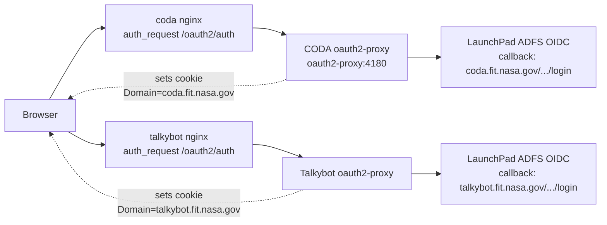
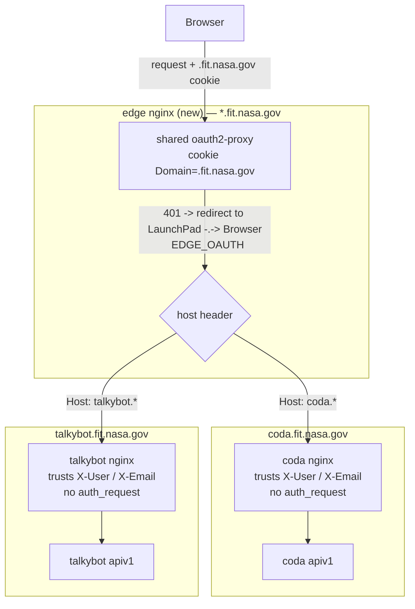
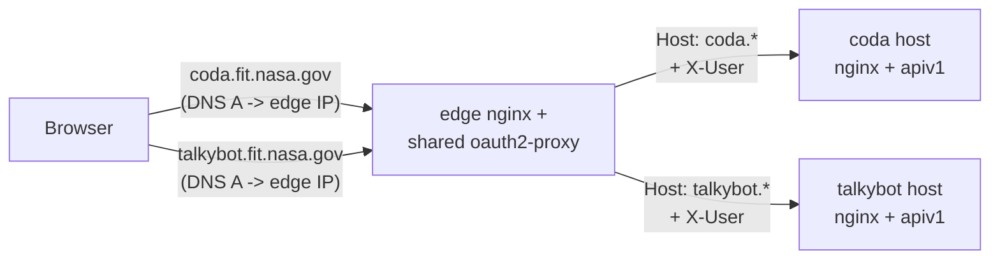
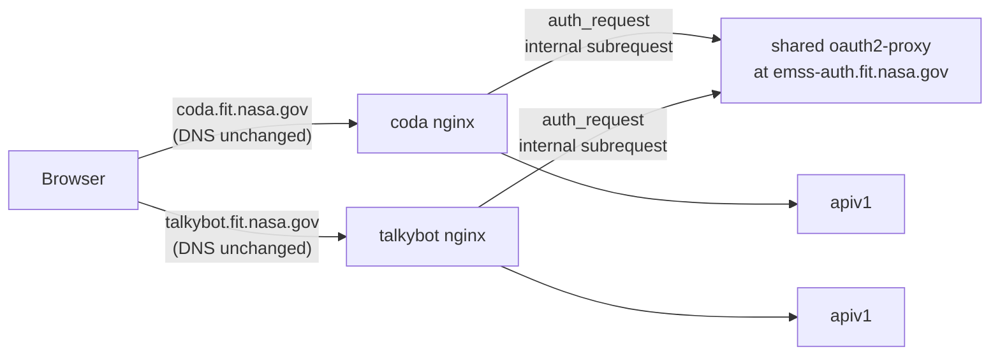
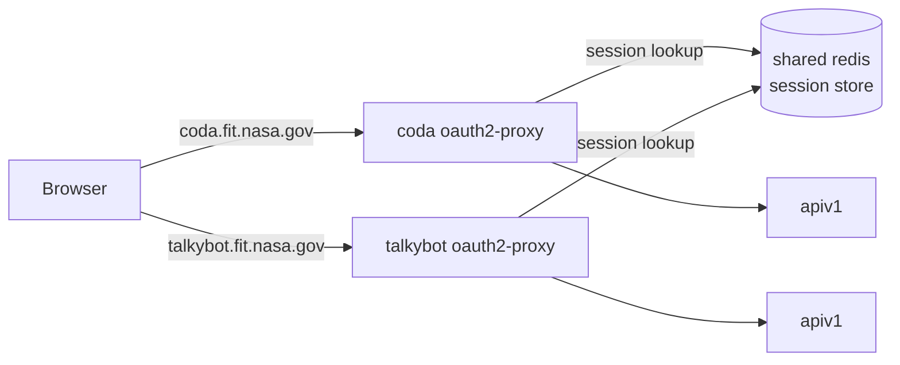
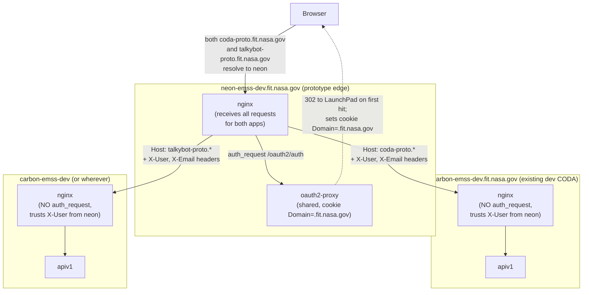

# Unified Launchpad Auth Across CODA and Talkybot

> **Status:** Design — companion document to
> [`PER_USER_TALKYBOT_ACCESS.md`](./PER_USER_TALKYBOT_ACCESS.md).
> That doc keeps the current "CODA proxies everything" model and adds a
> snapshot-based gate inside CODA. **This doc takes a different bet:**
> push the auth boundary above both apps so the CODA browser can talk
> to Talkybot directly, and let Talkybot's existing per-user permission
> logic run against the actual end user (not against CODA's shared
> service token).

## TL;DR

If both CODA and Talkybot sit behind a **single shared oauth2-proxy**
on a single parent domain (e.g. `*.fit.nasa.gov` with a domain-wide
session cookie), then a browser logged in to one is automatically
logged in to the other. With that in place:

- The CODA browser's `<audio>` element can fetch
  `https://talkybot.fit.nasa.gov/api/v1/external/audiofiles/:uuid/file`
  directly. Talkybot will see the **end user's** JWT, run its existing
  `authorization()` middleware, and serve or deny based on
  `ChannelUser` membership — no `x-api-key` bypass, no CODA proxy.
- CODA's comm transcript list can come from `GET /audiofiles` (the
  authed, public-filter variant), again hitting Talkybot directly
  with the user's cookie.
- The S2S socket can remain server-to-server for global push, **or**
  evolve into a per-user socket from the browser to Talkybot. We
  recommend keeping S2S as-is in v1.

CODA's server stops being on the access-control path for talkybot
audio entirely. Talkybot remains the source of truth and the enforcer,
which is what the Talkybot team wants.

## How auth works today (two separate sessions)



Verified properties of the current setup:

- CODA's `docker/nginx/setup-auth.conf` and `route-require-auth.conf`
  use the standard oauth2-proxy `auth_request` pattern. The end-user
  JWT is forwarded to the Express API via `X-Auth-Request-Access-Token`
  / `X-User` / `X-Email` headers and parsed by
  `@emss/oauth2-proxy-backend`'s `getUserFromJWT` (see
  `src/packages/getUser.ts`).
- Talkybot uses the **same** `@emss/oauth2-proxy-backend` package and
  the **same** `EmssUser` shape (see
  `talkybot/apps/server/middlewares/authorization.ts`). The
  application logic for "is this user allowed on this channel" already
  exists and is exercised by Talkybot's own first-party UI.
- LaunchPad is configured per-host: each app's nginx has a registered
  OIDC redirect URI of `https://<host>/api/v1/auth/nasalp/adfs/oidc/login`.
- The oauth2-proxy session cookie is per-host today; the browser
  treats `coda.fit.nasa.gov` and `talkybot.fit.nasa.gov` as separate
  origins with separate session state.

The end result: **CODA and Talkybot validate the same JWTs against the
same identity provider with the same code, but the browser sees them
as two unrelated apps.** Closing that gap is the entire premise of
this document.

## Architectural change: single oauth2-proxy on the parent domain



The key knobs:

1. **One oauth2-proxy instance** in front of both apps. The
   `auth_request` directive is no longer host-local; the edge proxy
   either serves the request (when the cookie is valid) or 302s to
   LaunchPad.
2. **Session cookie `Domain=.fit.nasa.gov`** (or whichever parent
   domain covers both hosts), `SameSite=Lax`, `Secure`. Browser sends
   the same cookie to both subdomains automatically. This is the
   single change that makes "logged in to one = logged in to both"
   true.
3. **Single registered redirect URI in LaunchPad** for the edge host
   (e.g. `https://auth.fit.nasa.gov/api/v1/auth/nasalp/adfs/oidc/login`),
   or one per subdomain pointing at the same proxy. The current
   per-app redirect URIs become unnecessary once the edge proxy owns
   the OIDC dance.
4. **CODA's and Talkybot's nginx blocks stop running `auth_request`**
   themselves. They just trust the upstream `X-User` / `X-Email` /
   `X-Auth-Request-Access-Token` headers because the edge proxy is the
   only path in. (Important: if the apps remain reachable by any path
   _other_ than the edge proxy — e.g. direct container ports — that
   trust assumption breaks. Network policy must enforce this.)
5. **Existing Express code is unchanged.** Both apps already read
   `EmssUser` from JWT headers via the shared library. They will see
   exactly the same user object they see today, the only difference is
   that the same browser session populated it on both hosts.

### A note on the word "upstream"

The word "upstream" gets used inconsistently in HTTP-reverse-proxy
discussions, so pinning it down for this doc:

- **nginx's formal "upstream" directive** refers to the backend that
  nginx forwards a request *to* (the `proxy_pass` target). In
  `docker/nginx/nginx.conf`, when you see
  `proxy_pass http://apiv1:3001/...`, `apiv1` is nginx's upstream by
  the literal nginx-config definition.
- **In this design doc**, when we say things like "CODA's nginx
  trusts upstream `X-User`" or "push the auth boundary upstream of
  the apps", we mean **closer to the client / earlier in the
  request flow**. That's the inverse direction from nginx's config
  vocabulary, but it's the standard sense in architecture
  discussions ("upstream service", "upstream dependency").

To avoid confusing the two, the rest of this doc uses **"in front
of"** for the client-side direction and **"behind"** for the
backend direction wherever possible.

So when this doc says **"CODA's nginx trusts `X-User` from in front
of it"**, the literal mechanism is: the shared oauth2-proxy (running
on the prototype edge host, e.g. neon) validates the session cookie,
mints an `X-User` / `X-Email` / `X-Auth-Request-Access-Token` header
set, and forwards the request to the appropriate app's nginx. That
app nginx no longer runs `auth_request` itself — it skips straight to
`proxy_pass http://apiv1:3001/...` and lets the headers flow through
to Express. `getUserFromJWT` reads them exactly as it does today.

### How does a request to `coda.fit.nasa.gov` actually reach the shared proxy?

This is the question that determines whether the design is operationally
realistic. The short version: **yes, every app in the SSO bubble must
route its inbound traffic through (or delegate auth to) the shared
proxy.** There is no DNS or HTTP mechanism that "magically" routes
`coda.fit.nasa.gov` through `emss-auth.fit.nasa.gov` — somebody has to
build the hop. The browser opens a TCP connection to whatever hostname
it typed; the shared cookie only matters once it's already getting
served (or 302'd) by something that knows to ask oauth2-proxy.

There are three concrete ways to make that hop happen, and the
**choice has real operational implications**, so the proposal must
pick one. They are listed from "biggest change to existing topology,
smallest per-app config burden" to "smallest topology change, most
per-app config burden."

#### Option 1: Edge proxy is the new front door (recommended)



Repoint the public DNS records for `coda.fit.nasa.gov`,
`talkybot.fit.nasa.gov`, etc. at the edge proxy's IP. The edge nginx
distinguishes apps by `Host:` and `proxy_pass`es each across the
network to the existing per-app host. Each app's own nginx stops
running `auth_request` (or scopes it to a fallback path only). The
existing per-app hosts move to private addressing or at minimum stop
being targets of any public DNS name in the SSO bubble.

- ✅ Apps don't need to know the edge exists — they just see
  upstream-validated headers. Auth code path is identical to today.
- ✅ Cleanest cookie story (one issuer, one cookie, one place to
  rotate the cookie secret).
- ✅ Easiest to add a fourth or fifth app to the bubble later — just
  add a `server { }` block on the edge.
- ❌ Requires DNS changes for production hostnames, which has
  organizational weight. Cutover needs a rollback story (TTL down
  ahead of time, dual-running for a window).
- ❌ Edge proxy becomes a hard production dependency. Needs HA, the
  same uptime SLO as the apps behind it, and 24/7 monitoring.
- ❌ Doubles the L7 hop for every request, which has latency and
  observability implications (trace context, request-ID propagation).

#### Option 2: Per-app nginx forwards `auth_request` to the shared proxy



Public DNS for `coda.fit.nasa.gov` and `talkybot.fit.nasa.gov`
remains pointed at the apps themselves. Each app's nginx keeps
running `auth_request`, but the directive is repointed at the
shared oauth2-proxy host instead of a sidecar oauth2-proxy in its
own compose. The shared proxy runs alone on `emss-auth.fit.nasa.gov`
and is reachable on the internal network from every app host.

- ✅ No public DNS changes. Cutover is a per-app nginx config edit.
- ✅ Per-app failure isolation: if Talkybot's nginx breaks, CODA
  keeps working.
- ✅ The shared proxy is only on the auth-decision path, not the
  data path, so latency impact is one extra internal subrequest per
  request (which oauth2-proxy already gates via its own caching).
- ❌ Every app keeps an nginx file that knows about the shared
  proxy's hostname and cookie name. Each app must redeploy when
  shared-proxy config changes (e.g. cookie name rotation).
- ❌ Cookie-issuance still happens at the shared proxy's host
  (`emss-auth.fit.nasa.gov`), which means the **first** auth flow
  for any user requires a redirect to that host and back. So even
  though the data plane stays per-app, the *initial* login path
  introduces a third hostname into the browser's URL bar briefly.
- ❌ Each app's nginx must accept the cookie that was set by the
  shared proxy on the parent domain. Works because the browser
  sends `.fit.nasa.gov` cookies to every subdomain — but it also
  means the apps see every other `.fit.nasa.gov` cookie too, which
  pollutes `req.headers.cookie`.

#### Option 3: Each app keeps its own oauth2-proxy but they share a Redis session store



Both apps run their own local oauth2-proxy as today, but configure
`OAUTH2_PROXY_SESSION_STORE_TYPE=redis` and
`OAUTH2_PROXY_REDIS_CONNECTION_URL=redis://shared-redis.fit.nasa.gov`
to point at a shared Redis. The session cookie is set with
`Domain=.fit.nasa.gov` so the browser sends it to both apps. Each
local oauth2-proxy validates the cookie against the shared session
store independently.

- ✅ No edge proxy. Existing topology preserved.
- ✅ Each app retains full local control of its auth flow and can
  fail closed independently.
- ✅ Failover is per-app: shared Redis going down breaks new logins
  but ongoing sessions survive long enough to swap to a hot spare.
- ❌ Three oauth2-proxy instances must agree on `COOKIE_SECRET`,
  `CLIENT_ID`, `CLIENT_SECRET`, and `REDIRECT_URL` semantics.
  Drift is a real risk; ops gets harder, not easier, despite the
  fact that we "didn't change the topology."
- ❌ LaunchPad redirect URI must be registered for each app host
  (today's situation, preserved). Adding a new app requires a
  LaunchPad ticket.
- ❌ Doesn't fully realize the "single auth boundary" goal. The
  decision logic is still in N places; they just happen to consult
  the same store. Hard to reason about subtly-different behavior.

#### Recommendation

**Option 1 for production.** It's the cleanest topology and the only
one that genuinely puts auth in a single place. The DNS-change cost
is one-time and well-understood.

**Option 2 is the right intermediate step** — and it's effectively
what the prototype on neon achieves once you flip the prototype
hostnames back to their real ones. We can ship Option 2 production
first (low DNS-blast-radius, per-app cutover) and migrate to Option
1 later if the value is clear.

**Option 3 is a fallback** if the platform team won't host a
production edge proxy at all. It's worth knowing it exists because
it lets the unified-cookie story ship even without organizational
buy-in for an edge service, but it carries the highest hidden ops
cost long-term.

The neon prototype below is structurally Option 1 (neon is the front
door for the prototype hostnames). The transition from prototype to
production is "swap the prototype hostnames for the real ones and
add HA."

## Prototyping on `neon-emss-dev.fit.nasa.gov` (or any single dev host)

The doc above assumes a future `emss-auth.fit.nasa.gov` (or similar)
edge host. We don't have that yet, and we don't need it to prove the
concept. Any dev box on the `*.fit.nasa.gov` parent domain — `neon`,
`carbon`, `gold`, whatever has the spare capacity — can host the
shared oauth2-proxy for a prototype, and the rest of the design works
unchanged. This section explains exactly how, including the
"do we need a special new app?" question (short answer: **no**, we
already have the app — it's just `oauth2-proxy`).

### Answering the obvious questions first

**"Do we need to run a special app on neon that just does auth?"**

No. `oauth2-proxy` *is* that app. It's an off-the-shelf reverse proxy
whose only job is "validate session cookie, redirect to OIDC if
missing, forward authenticated requests onward." We already run one
instance per CODA environment — `docker-compose.yml`'s
`oauth2-proxy` service using `quay.io/oauth2-proxy/oauth2-proxy:v7.5.1`.
The prototype runs the **same image** on neon with three configuration
changes:

1. `OAUTH2_PROXY_COOKIE_DOMAINS=.fit.nasa.gov` — currently the cookie
   defaults to the host the proxy answers on (e.g.
   `coda-local.fit.nasa.gov`), which is exactly the per-host
   isolation we want to break.
2. `OAUTH2_PROXY_WHITELIST_DOMAIN=.fit.nasa.gov` — already
   parameterized in CODA's compose as
   `${OAUTH2_PROXY_WHITELIST_DOMAIN}`; the value needs to widen to
   include the parent domain so post-login redirects targeting any
   `*.fit.nasa.gov` host are accepted.
3. `OAUTH2_PROXY_REDIRECT_URL=https://<prototype-host>/api/v1/auth/nasalp/adfs/oidc/login`
   — the OIDC callback URL points at the prototype host, not the
   per-app host. This URL must also be registered with LaunchPad
   (see step 2 of the setup below).

No new image, no new application code, no Talkybot rebuild.

**"What does the prototype actually look like physically?"**



The picture is: **neon is the front door.** Both the prototype CODA
hostname and the prototype Talkybot hostname point (via DNS) at
neon's nginx. Neon's nginx runs `auth_request` against neon's local
oauth2-proxy. Once oauth2-proxy approves the request, neon's nginx
adds the `X-User` / `X-Email` / `X-Auth-Request-Access-Token` headers
and `proxy_pass`es the request *across the network* to whichever
dev box actually runs CODA or Talkybot. Those dev boxes don't run
their own auth — they trust the headers because the only legitimate
path into them is via neon.

### Concretely, how to set it up

1. **Pick prototype hostnames** that resolve to neon. E.g.
   `coda-proto.fit.nasa.gov` and `talkybot-proto.fit.nasa.gov`,
   both DNS-A-records pointing at neon's IP. (Wildcard certs covering
   both work; otherwise issue two certs.)
2. **Register one LaunchPad redirect URI** for the prototype:
   `https://coda-proto.fit.nasa.gov/api/v1/auth/nasalp/adfs/oidc/login`
   *(or pick whichever single host you want to own the callback —
   one is enough because the cookie is shared across the parent
   domain).*
3. **On neon**, run a compose stack with `nginx` + `oauth2-proxy` +
   `redis`. Lift the oauth2-proxy service definition straight from
   `coda/docker-compose.yml` and change three env vars:

   ```diff
   - OAUTH2_PROXY_REDIRECT_URL=https://coda-local.fit.nasa.gov/api/v1/auth/nasalp/adfs/oidc/login
   + OAUTH2_PROXY_REDIRECT_URL=https://coda-proto.fit.nasa.gov/api/v1/auth/nasalp/adfs/oidc/login
   + OAUTH2_PROXY_COOKIE_DOMAINS=.fit.nasa.gov
   - OAUTH2_PROXY_WHITELIST_DOMAIN=authfs.launchpad-sbx.nasa.gov
   + OAUTH2_PROXY_WHITELIST_DOMAIN=authfs.launchpad-sbx.nasa.gov,.fit.nasa.gov
   ```

4. **Neon's nginx config** runs `auth_request` against the local
   oauth2-proxy (same `setup-auth.conf` / `route-require-auth.conf`
   blocks that already exist in `coda/docker/nginx/`). Then it has
   two `server { }` blocks differentiated by `server_name`:

   ```nginx
   # /etc/nginx/conf.d/coda-proto.conf  (sketch)
   server {
       listen 443 ssl;
       server_name coda-proto.fit.nasa.gov;
       include setup-auth.conf;
       location / {
           include route-require-auth.conf;
           # proxy_pass to wherever the existing CODA dev stack lives:
           proxy_pass http://carbon-emss-dev.fit.nasa.gov;
           proxy_set_header Host $host;
       }
   }
   server {
       listen 443 ssl;
       server_name talkybot-proto.fit.nasa.gov;
       include setup-auth.conf;
       location / {
           include route-require-auth.conf;
           proxy_pass http://<talkybot-dev-host>;
           proxy_set_header Host $host;
       }
   }
   ```

   `setup-auth.conf` and `route-require-auth.conf` are reused verbatim
   from CODA's repo. The `auth_request_set` / `proxy_set_header`
   lines in `route-require-auth.conf` are precisely what populates
   the `X-User` / `X-Email` / `X-Access-Token` headers that the
   downstream apps will read.

5. **CODA dev and Talkybot dev nginx changes.** Each app's existing
   nginx has the `auth_request` directive removed (or its `server { }`
   wrapped to only require auth for direct-access paths and to skip
   it when the request arrives from neon — selected, e.g., by a
   shared `X-Forwarded-By: emss-auth-proto` header that neon sets and
   the dev box's nginx checks). The Express code reads the same
   header set as today, so no application change.

6. **Verify.** Open `https://coda-proto.fit.nasa.gov` in a clean
   browser. You should be redirected to LaunchPad, return, and land
   in CODA. Open `https://talkybot-proto.fit.nasa.gov` in a new tab.
   No second LaunchPad redirect — you should land in Talkybot
   already logged in, with `document.cookie` showing the same
   `SESSION` cookie on both hosts. At that point, comm's direct
   `<audio>` fetch to Talkybot will carry the cookie and Talkybot's
   `authorization()` middleware will see the real user.

### Why this is genuinely cheap

- **No new application is written.** Neon runs oauth2-proxy (the same
  Docker image already in CODA's compose) and nginx (same image).
- **No CODA or Talkybot source change is required for the
  prototype.** The only edits are in nginx config files and one new
  env var. CODA's Express code, Talkybot's Express code, and the
  React app all behave identically — they just receive the user from
  a session cookie that happens to also be valid on the other host.
- **No Talkybot CORS change is required to demonstrate single
  sign-on.** CORS only becomes necessary in M2 of the migration plan
  when comm starts calling Talkybot from JS. M0's acceptance test
  (cookie shared across both hosts) doesn't touch JS at all.
- **Reversible by changing one DNS record.** Point
  `coda-proto.fit.nasa.gov` back at carbon-emss-dev's own nginx and
  the prototype is gone.

### What this prototype *doesn't* prove

- It doesn't prove the production deployment path. Production needs
  the edge proxy hosted somewhere durable (`emss-auth.fit.nasa.gov`
  or similar), HA / failover, log aggregation, etc. M0 in the
  migration plan covers that; the neon prototype is upstream of M0
  conceptually (literally a "is the model sound?" experiment).
- It doesn't prove the cookie-blast-radius story. Once cookie
  `Domain=.fit.nasa.gov` is set in the prototype, every other
  `*.fit.nasa.gov` host will start receiving the `SESSION` cookie
  too. For the prototype this is harmless because nobody else's app
  is looking for that cookie name, but the production rollout
  requires an audit pass (see Risks below).
- It doesn't replace per-host LaunchPad redirect URIs in production
  apps. The prototype just registers one extra redirect URI; the
  per-host ones on `coda.fit.nasa.gov` and `talkybot.fit.nasa.gov`
  keep working as they do today.

## What changes in CODA's comm component

Today (post v1 audio-proxy fix, see
`src/components/panes/comm.tsx`):

```ts
// transcript list + audio metadata: arrives over CODA's socket pipeline,
// originally fetched server-side from Talkybot using EMSS_TOKEN.

// audio playback:
newSrcUrl = `/api/v1/external/audiofiles/${file.fileUuid}/file`;
// -> CODA proxy -> Talkybot with x-api-key
```

After unified auth, comm becomes a direct Talkybot client:

```ts
// transcript list: hit Talkybot directly with the user's cookie.
const tbBase = import.meta.env.VITE_PUBLIC_TALKYBOT_URL;
const res = await fetch(
  `${tbBase}/api/v1/external/audiofiles?date=${dateWanted}`,
  { credentials: "include" } // sends the shared .fit.nasa.gov cookie
);

// audio playback: src directly at Talkybot. CORS preflight is not needed
// for plain `<audio src>` GETs, and the cookie is sent automatically
// because the cookie's Domain covers the talkybot subdomain.
newSrcUrl = file.audioUrl || `${tbBase}/api/v1/external/audiofiles/${file.fileUuid}/file`;
```

Things to notice:

- **Talkybot's `/audiofiles` (without `/all`) already exists and
  honors per-user channel filtering** for first-party Talkybot users.
  When the JWT arrives via the shared cookie, Talkybot's default
  `EntitySchema` filter on `Channel` (`enabled: true, public: true`
  OR `enabled: true AND users.ndcId == auid`) does exactly what we
  want with zero new code.
- The current `EMSS_TOKEN`/`x-api-key` path on Talkybot's
  `/audiofiles/all` and `/audiofiles/:uuid/file` becomes a CODA-server
  concern only — the browser path stops needing it. We keep
  `EMSS_TOKEN` for the daily-batch fetch in
  `src/server/processing/talkybot.ts` and for any S2S socket emission,
  but it no longer touches the per-user comm experience.
- **CODA's `routes/external/audiofiles.ts` proxy goes away.** Same
  for the nginx `location /api/v1/external/audiofiles` block. Same
  for `EmssUser`-snapshot machinery in
  [`PER_USER_TALKYBOT_ACCESS.md`](./PER_USER_TALKYBOT_ACCESS.md) §1-5
  — Talkybot is the authority, the snapshot becomes irrelevant.

## What changes in Talkybot

This is the section that determines whether the Talkybot team will
accept the proposal. The honest answer: **almost nothing required in
application code**. The required changes are operational / config /
nginx, and they are reversible without touching application source:

1. **Stop running its own oauth2-proxy** in favor of the shared edge
   proxy. Talkybot's `apps/server` keeps reading the same headers from
   the same shared library; from its perspective the auth boundary
   just moved up the stack.
2. **Update Talkybot's nginx** to trust upstream `X-User` etc.
   instead of running `auth_request` against a local oauth2-proxy
   container.
3. **CORS allowance for `coda.fit.nasa.gov`** on the endpoints comm
   will call:
   - `GET /api/v1/external/audiofiles` — needs
     `Access-Control-Allow-Origin: https://coda.fit.nasa.gov` (or
     `*.fit.nasa.gov` wildcard via dynamic origin echo) and
     `Access-Control-Allow-Credentials: true`. Without these, the
     `fetch(..., { credentials: "include" })` for the JSON transcript
     list will fail.
   - `GET /api/v1/external/audiofiles/:uuid/file` — **plain
     `<audio src>` does not require CORS at all** (it's a no-cors
     media request), as long as the response is decodable audio. So
     the file endpoint actually needs no CORS changes; only the JSON
     list endpoint does.
4. **No schema change. No new permission model. No CODA-specific
   route. No new shared secret.** The `keyAuthorization("coda")`
   middleware stays exactly as it is for S2S use cases that don't
   carry a user (the daily batch fetch, ephemeris-style sync, etc.).

That's it on the Talkybot side. The "massive change" the team is
allergic to is something like "Talkybot maintains a session per CODA
user" (alternative A in the companion doc); this design is the
opposite of that. The auth model Talkybot already has — JWT in,
`ChannelUser` lookup, allow/deny — runs against the real end user
exactly as it does for Talkybot's own UI.

## Migration plan

Each milestone is independently mergeable, runnable, and reversible.

**M0 — Operational readiness.**

- Stand up the shared edge oauth2-proxy in lower environments
  (e.g. `*.fit.nasa.gov-dev`).
- Register the parent-domain cookie and the consolidated LaunchPad
  redirect URI.
- Confirm that an unauthenticated browser visiting either CODA-dev
  _or_ Talkybot-dev follows the same auth flow and ends up with the
  shared cookie.
- Acceptance test: open Talkybot-dev, log in; open CODA-dev in a new
  tab; `document.cookie` shows the same session; `/api/v1/user/current`
  on both returns the same `EmssUser`.

**M1 — Talkybot CORS for the JSON list endpoint.**

- Add `cors({ origin: /.*\.fit\.nasa\.gov$/, credentials: true })` (or
  the equivalent) to Talkybot's `GET /external/audiofiles` route
  only. The file endpoint and the existing `keyAuthorization` routes
  are untouched. Tiny, low-risk Talkybot MR.

**M2 — CODA comm direct read for the transcript list.**

- In `comm.tsx`, replace the socket-delivered audio list (for v1 of
  this migration, only in environments where the shared cookie is in
  effect — feature-gate on `VITE_USE_DIRECT_TALKYBOT=true`) with a
  direct `fetch(...{credentials:"include"})` to
  `talkybot.fit.nasa.gov/api/v1/external/audiofiles?date=...`.
- Keep CODA's server-side daily-batch fetch in place; it's still useful
  for users who are not authenticated to Talkybot's channel access
  (and remains the failsafe if the unified-auth experiment is rolled
  back).
- Result: the transcript pane is now filtered per-user by Talkybot,
  not by CODA.

**M3 — CODA `<audio src>` direct.**

- Switch `newSrcUrl` in `comm.tsx` to the absolute Talkybot URL.
- Remove the v1 CODA proxy route
  (`src/server/express/routes/external/audiofiles.ts`) and the
  matching `location /api/v1/external/audiofiles` nginx block.
- Remove `VITE_PUBLIC_TALKYBOT_URL` usage from the CODA _backend_?
  No — keep it; the daily-batch fetch and S2S socket still need it.
- Acceptance test: user A (in channel X) hears channel X audio;
  user B (not in channel X) hears nothing for channel X and sees the
  utterance disappear from the transcript pane.

**M4 — Decide on S2S socket evolution.** Two options, both viable:

- **Keep S2S as-is.** Talkybot pushes new files to CODA server, CODA
  server fans out via `incrementalDataUpdate` socket events to
  visitors. CODA still needs the channelAccessSnapshot consumer
  (companion doc §1-3) to filter the fan-out — _unless_ CODA stops
  socketing new audio at all and the browser polls Talkybot's
  `/audiofiles?date=` for the current day every N seconds. Polling
  is uglier but eliminates the snapshot consumer entirely.
- **Browser opens a Socket.IO connection directly to Talkybot** for
  real-time audio push, using the shared cookie. This is a larger
  Talkybot change (CORS for Socket.IO, room-per-user instead of
  one-room-fits-all S2S) and is probably **not worth doing in v1**.
  Mark it as a separate future design if real-time push proves
  necessary.

Recommendation: pick "keep S2S as-is + polling-based real-time on
comm pane" for the prototype; revisit if poll cadence proves
inadequate.

**M5 — Decommission CODA-side audio gating code.**

- Delete the v1 proxy route and tests.
- Delete the channel-access-snapshot consumer (if M2 of the companion
  doc shipped). Move snapshot consumption to "operator visibility
  only" or remove entirely.
- Update `RESTRICTED_OVERRIDES.md` and
  `PER_USER_TALKYBOT_ACCESS.md` cross-references.

## Alternatives considered (and rejected)

### A. Shared cookie but keep CODA as proxy

> _Get the unified cookie working, but leave CODA's proxy in place
> "for safety"._

If CODA still proxies, the proxy must continue to gate (otherwise it
becomes an open relay because the original gate — Talkybot's session
absence in the browser — is gone). The whole point of unifying auth
is to delete CODA's gating code; halfway-ing it gives the worst of
both designs.

### B. Token exchange ("federation")

> _Each app keeps its own oauth2-proxy and cookie; on first visit,
> one app issues a short-lived signed token the other accepts._

This is more code than just sharing the cookie. It also doesn't help
with `<audio src>` cross-origin behavior because the browser still
sees two origins. Rejected.

### C. mTLS / service-to-service identity for CODA -> Talkybot

> _Replace `EMSS_TOKEN` with mTLS so CODA can attest "this request
> belongs to user X" via a signed header._

Useful for CODA's S2S calls (and orthogonal to the browser story),
but doesn't address comm's `<audio>` block at all. Worth doing
independently if the EMSS platform team wants to retire shared
secrets, but out of scope here.

### D. Move comm rendering into a Talkybot-hosted iframe

> _Embed Talkybot's existing transcript UI as an iframe inside CODA._

Solves auth (Talkybot serves its own page to its own session) but
loses CODA-native styling, timeline integration, playhead sync, and
the per-event override system. Rejected on UX grounds.

## Implications & risks

- **Single point of failure.** A misconfigured edge oauth2-proxy
  takes down auth for _every_ app behind it. Mitigation: run the
  edge proxy in HA, monitor it as critical infrastructure, keep
  per-app proxies hot-swappable for rollback (M0 — M4 are reversible
  by reverting nginx config).
- **Cookie domain blast radius.** A `.fit.nasa.gov` cookie is sent to
  every subdomain. Any app on the parent domain that wasn't intended
  to be part of the SSO bubble must explicitly opt out, or its
  requests will carry the auth cookie. Audit existing
  `*.fit.nasa.gov` hosts before flipping the cookie domain.
- **CSRF surface grows.** Any subdomain can now make
  `credentials: "include"` requests to any other and the cookie
  goes along. Talkybot's CORS allowlist becomes load-bearing. Don't
  loosen it to `*`.
- **Talkybot becomes a hard runtime dependency for the CODA comm
  pane.** Today, CODA can render comm even if Talkybot's REST is
  unreachable, because the data is cached server-side and bytes are
  proxied with `EMSS_TOKEN`. After M3, Talkybot down = comm pane
  silent. Mitigation: keep the daily-batch CODA fetch alive so CODA
  has at least the transcript list as a fallback; show a clear
  banner ("audio temporarily unavailable") if direct Talkybot calls
  fail.
- **Per-channel filtering quality is now Talkybot's job.** If a CODA
  user is missing audio they expect, the on-call answer is "check
  Talkybot's `ChannelUser` for this AUID" — not "check the snapshot
  consumer in CODA". This is the desired end state but it's a
  rotation handoff.
- **Browser caching of restricted audio.** A user who briefly had
  access to a channel could keep playing the file from their browser
  HTTP cache after access is revoked, until the cache entry expires.
  Mitigation: Talkybot should send `Cache-Control: private,
max-age=300` or similar on `/audiofiles/:uuid/file` so eviction
  happens reasonably fast. The same risk exists today in the v1
  proxy world.

## Out of scope

- AEGIS, Maestro, and any other EMSS app. The same unified-auth model
  could absorb them, but each one is its own rollout and risk
  conversation.
- Replacing `EMSS_TOKEN` for S2S use (see Alternative C).
- A consolidated user-management UI across apps.

## Open questions for review

1. **Cookie domain scope.** Is `.fit.nasa.gov` the right parent, or do
   we want a tighter bubble (e.g. `.emss.fit.nasa.gov` if we can
   migrate hostnames)?
2. **Edge proxy ownership.** Who runs the shared oauth2-proxy — CODA
   team, Talkybot team, or EMSS platform team?
3. **M4 real-time strategy.** Polling Talkybot for new audio on the
   comm pane vs keeping the S2S socket + filtered fan-out. We've
   leaned polling; confirm.
4. **Rollback contract.** If unified auth gets disabled, the v1 CODA
   proxy and the snapshot consumer have to come back. Worth keeping
   those code paths feature-flagged rather than fully deleting in
   M5?
5. **Talkybot CORS posture.** Echo-origin against a regex allowlist,
   or static `Access-Control-Allow-Origin` per environment? Echo is
   more flexible but more error-prone.
